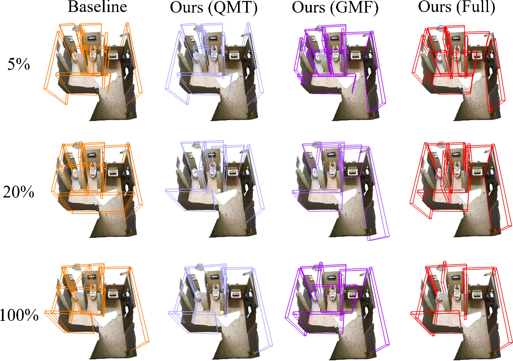
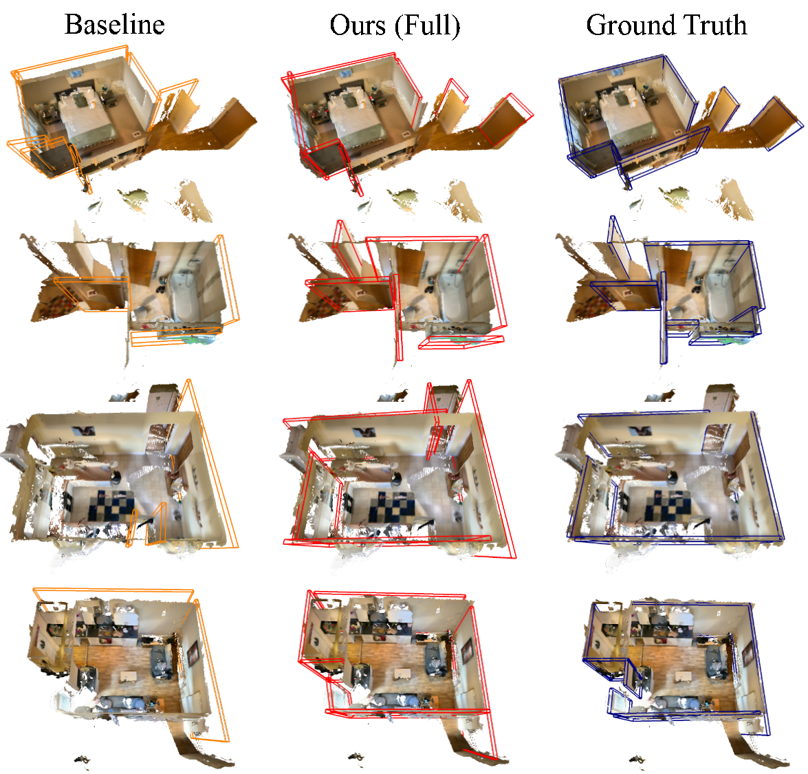

# From Semi-supervised to Omni-supervised Room Layout Estimation Using Point Clouds


This repository contains the official implementation of the proposed architecture in [paper](https://arxiv.org/abs/xxxx.yyyyy), accepted by ICRA 2023.

> **Semi-supervised to Omni-supervised Room Layout Estimation Using Point Clouds**
>
> Authors: *Huan-ang Gao, Beiwen Tian, Pengfei Li, Xiaoxue Chen, Hao Zhao, Guyue Zhou, Yurong Chen and Hongbin Zha*
>
> [Institute for AI Industry Research (AIR), Tsinghua University](https://air.tsinghua.edu.cn/en/)


## Introduction
> Room layout estimation is a long-existing robotic vision task that benefits both environment sensing and motion planning. However, layout estimation using point clouds (PCs) still suffers from data scarcity due to annotation difficulty. As such, we address the semi-supervised setting of this task based upon the idea of model exponential moving averaging. But adapting this scheme to the state-of-the-art (SOTA) solution for PC-based layout estimation is not straightforward. To this end, we define a quad set matching strategy and several consistency losses based upon metrics tailored for layout quads. Besides, we propose a new online pseudo-label harvesting algorithm that decomposes the distribution of a hybrid distance measure between quads and PC into two components. This technique does not need manual threshold selection and intuitively encourages quads to align with reliable layout points. Surprisingly, this framework also works for the fully-supervised setting, achieving a new SOTA on the ScanNet benchmark. Last but not least, we also push the semi-supervised setting to the realistic omni-supervised setting, demonstrating significantly promoted performance on a newly annotated ARKitScenes testing set. Our codes, data and models are released in this repository.


## Environment Preparation

Our code needs `python=3.6` and `CUDA>=10.1` to run. We recommend you to use `conda` to create a new environment and install the required packages by running the following command:

```bash
conda create -n omni-pq python=3.6
conda activate omni-pq
```

Then we can install PyTorch and CUDAToolKit by:
```bash
conda install pytorch==1.10.1 torchvision==0.11.2 torchaudio==0.10.1 cudatoolkit=11.3 \
        -c pytorch -c conda-forge
```

We can install the required packages by running the following command:

```bash
pip install -r requirements.txt
```

Also after you install the pre-requisites, you need to build PointNet++ locally by running the following command:

```bash
cd pointnet2
python3 setup.py install
``` 


## Data Preparation
### ScanNet

For ScanNet dataset, please follow these instructions:

1. Download ScanNet v2 data from [here](https://github.com/ScanNet/ScanNet). Move/link the `scans` folder such that under `scans` there should be folders with names such as `scene0001_01`.

2. Extract point clouds and annotations (semantic seg, instance seg etc.) by running `python3 batch_load_scannet_data.py`, which will create a folder named `scannet_train_detection_data` here.

3. Download plane annotation for ScanNet v2 dataset from [here](https://github.com/skanti/SceneCAD) and extract the `scannet_planes` folder to the same directory as the previous step. 

4. In `scannet` directory, run `python3 compute_normal_for_pc.py` to pre-compute the normal for each point in the point cloud.


After this, you will have a `scannet` folder looking like described in `docs/scannet_directory.txt`.


### ARKitScenes

For ARKitScenes dataset, please follow these instructions:

1. Download ARKitScenes dataset from [here](https://github.com/apple/ARKitScenes). We only need the `3dod` dataset in the aformentioned repository. Then extract the `ARKitScenes` folder to the same directory as the previous step.

2. Follow instructions [here](https://github.com/apple/ARKitScenes/tree/main/threedod) to prepare whole scene data offline.

3. Step into `ARKitScenes/dataset` and run `python3 compute_normal_for_pc.py` to pre-compute the normal for each point in the point cloud.


## Getting Started

### Training

We provide a script `train.sh` for quick start. You can run the following command to train the model:

```bash
bash train.sh --checkpoint_path=pretrained_model/T10-base.pth --rate 0.10
```

We first train the original PQ-Transformer model with 10% labeled data and save the checkpoint with name `T10-base.pth`. Then for our semi-supervised training, we specify the checkpoint path of the original model to resume and set the `rate` to control the amount of labeled data.

We provide `T10-base.pth` and `T100-base.pth` for quick start. You can download them in the Model Zoo section below.

For training models for ARKitScenes dataset, simply put `--arkit` as a flag in the command line.

### Evaluation

For evaluation we also provide a script `eval.sh` for you. You can run the following command to evaluate the model:

```bash
bash eval.sh --checkpoint_path pretrained_model/T10.pth
```

Here you only need to specify the checkpoint path of the model you want to evaluate.

For evaluation models for ARKitScenes dataset, also simply put `--arkit` as a flag in the command line.


## Models

We provide you with the bold-styled models in the following table:

| Method         | 5%           | 10%          | 20%          | 30%          | 40%          | 100%         |
| -------------- | ------------ | ------------ | ------------ | ------------ | ------------ | ------------ |
| PQ-Transformer | 22.43        | **29.26** | 39.60        | 46.02        | 48.08        | **56.64**        |
| Ours           | **29.08** | **36.85** | **48.68** | **54.35** | **56.92** | **60.75** |

| Method         | Recall (%) | Precision (%) | F1-score (%) |
| -------------- | ---------- | ------------- | ------------ |
| PQ-Transformer | 6.72       | 25.81         | **10.66** |
| Ours           | 23.00      | 29.50         | **25.85** |

Note that in our paper, we report the median performance of each experiment setting over three runs. Here we provide you with checkpoints with the same random seed 0.

You can download these models at [ [Google Drive]() | [Tsinghua Cloud Storage]() ] and place them under `pretrained_model` directory. If the directory does not exist, you can create one.

## Qualitative Results






## Citation
If you find this work useful for your research, please cite our paper:
```bibtex
@article{
    TODO
}
```

## Acknowledgement

We build our codebase on [PQ-Transformer](https://github.com/OPEN-AIR-SUN/PQ-Transformer), a 3D point cloud transformer for joint object detection and layout estimation. We also give credits to [Mean Teacher](https://github.com/CuriousAI/mean-teacher) and [SESS](https://github.com/Na-Z/sess).